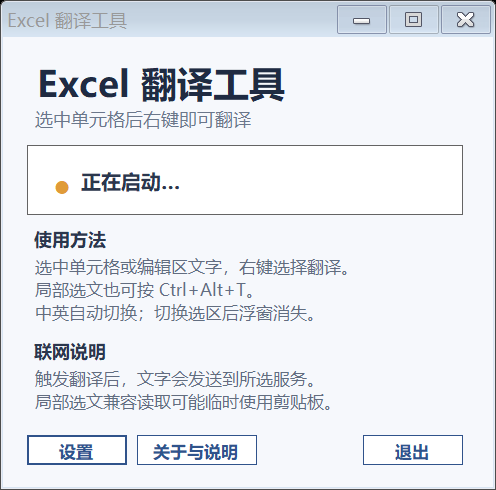
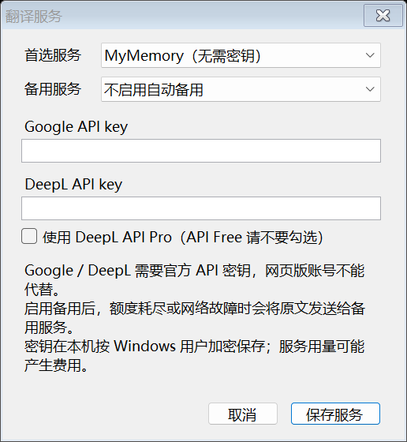

# Excel 单元格翻译工具

在 Windows 桌面版 Excel 的**原生右键菜单**中翻译单元格或选中的文字，译文显示在旁边的浮窗中。切换选区后浮窗消失，原单元格保持不变。

A small Windows tray utility for translating Excel cells and selected text between Chinese and English, using Excel's native context menu.

[下载 Windows 版本](https://github.com/Theoic123/excel-cell-translator/releases/latest) · [详细使用说明](使用说明.md) · [报告问题](https://github.com/Theoic123/excel-cell-translator/issues) · [仅限使用许可](LICENSE)

**许可：允许使用，未经作者书面许可禁止修改和再分发。** 本项目公开源码供查看及原样编译使用，采用自定义的仅限使用许可，不属于开源软件。GitHub 平台条款允许的站内查看 / Fork 等权利不受此声明限制，具体以 [LICENSE](LICENSE) 为准。

## 功能

- **中英自动切换**：包含中文汉字时译成英文，否则按英文译成中文；中英混合内容译成英文。
- **整格翻译**：支持单个文字单元格、一个完整的合并单元格，以及结果为文字的公式。
- **局部翻译**：双击 / F2 编辑单元格，或在公式栏中选中文字，使用原生菜单中的“翻译所选文字”或 `Ctrl+Alt+T`。
- **字段名分词**：`Region_Score_Limit` 会按 `Region Score Limit` 送去翻译，原单元格的下划线保持不变。
- **多服务选择**：MyMemory、Google Cloud Translation、DeepL API Free / Pro，可配置备用服务。
- **托盘常驻**：关闭主窗口后继续运行，从托盘菜单选择“退出”才完全关闭。

局部选文依赖 Excel 与 Windows 提供的选文能力，不同 Office 版本可能存在兼容差异。读取失败会提示错误，不会替你翻译整格。当前版本的验证范围见[测试与已知限制](#测试与已知限制)。

## 演示图

下面的流程图是**操作示意图，不是 Excel 实机截图**；示例文本与译文仅用于讲解步骤。


以下为程序自身窗口的实际渲染图，使用测试示例内容，不含业务表格或 API 密钥。

| 主窗口 | 翻译浮窗 |
| --- | --- |
|  |  |



## 安装与首次使用

### 运行环境

- Windows **64 位**，安装 .NET Framework 4.x。
- 已安装并可正常打开 **Microsoft Excel 桌面版**；当前开发与验证环境为 Office 16。
- 能访问所选翻译服务的网络。
- Excel 网页版、WPS 和 macOS 不在支持范围内。

### 下载并运行

1. 在 [Releases](https://github.com/Theoic123/excel-cell-translator/releases/latest) 下载 `ExcelCellTranslator-v0.1.0-windows-x64.zip`。GitHub 自动生成的 “Source code” 是源码包，不包含编译好的程序。
2. 解压到自己的文件夹，双击 `ExcelTranslator.exe`，无需安装加载项或启用宏。
3. 打开 Excel 工作簿，先处于普通单元格状态，等待工具显示“已连接 Excel”。
4. 保持工具与 Excel 以同一个 Windows 用户、相同权限运行，通常使用普通权限即可。

发布包同时提供 SHA-256 校验文件，可使用 `Get-FileHash .\ExcelCellTranslator-v0.1.0-windows-x64.zip -Algorithm SHA256` 核对下载文件。

### 翻译整个单元格

1. 单击一个有文字的单元格，例如 `Hello world`。
2. 右键 → **翻译（中英自动切换）**。
3. 在单元格旁查看译文；切换到其他单元格后浮窗消失。

### 只翻译一段文字

1. 双击单元格或按 **F2**，拖选其中一段；也可以在上方公式栏里选中文字。
2. 右键 → **翻译所选文字（Ctrl+Alt+T）**，或按 `Ctrl+Alt+T` 后松开按键。
3. 浮窗只显示该段文字的译文。修改选区或继续输入会使浮窗关闭。

工具不会为了读取选文而替你按 Enter 或 Escape，不会提交或取消单元格编辑。

## 翻译服务设置

打开工具的 **设置 → 翻译服务 / API 密钥**。

| 服务 | 需要填写什么 | 说明 |
| --- | --- | --- |
| MyMemory | 无需密钥 | 默认服务，有免费额度限制；额度以[官方说明](https://mymemory.translated.net/doc/usagelimits.php)为准。 |
| Google Cloud Translation | Google Cloud API key | 使用官方 v2 API，需要对应项目启用服务及有效的 API 权限。 |
| DeepL API Free / Pro | DeepL API key | Free 不勾选 Pro；Pro 勾选“使用 DeepL API Pro”。 |

Google / DeepL 的网页账户或网页订阅不等于 API 访问权限。服务可能计费，收费、地区和网络可用性以服务商为准。接口资料：[Google](https://cloud.google.com/translate/docs/reference/rest/v2/translate)、[DeepL](https://developers.deepl.com/api-reference/translate)。

备用服务默认关闭。显式设置后，首选服务额度不足或遇到可重试的网络 / 服务错误时，工具才会尝试备用服务。认证错误和配置错误会直接提示。

## 隐私与数据

- **点击翻译或按快捷键后，所选文字会发送给你配置的翻译服务。** 启用备用服务意味着同一段原文可能再次发送给备用服务。
- 不修改单元格，不插入批注 / 文本框，不写入宏，不修改 Excel 信任中心，不设置开机启动。
- API 密钥使用 Windows 当前用户的 DPAPI 加密，保存在 `%LOCALAPPDATA%\ExcelCellTranslator\provider-settings.json`。
- 最近 64 条查询的缓存只保存在内存中，退出后清除，不写入翻译历史。
- 局部选文必要时会使用复制兼容读取：先保存可安全保留的剪贴板内容，再复制选文，并在剪贴板未被其他操作更新时恢复。无法安全保存的特殊格式会提示失败。
- 项目不包含任何 API 密钥。提交 Issue 时请使用虚构示例文本，并移除截图中的私人信息。

## 常见问题

**没有看到右键翻译项？** 先结束当前单元格编辑，确认工具显示“已连接 Excel”，等待几秒后重试。工具仅连接一个 Excel 应用实例；同一实例内可切换工作簿。

**提示无法读取所选文字？** 确认已经进入编辑状态并拖选了文字。可以在公式栏里重新选取，或尝试 `Ctrl+Alt+T`。局部选文受 Office 版本、焦点与剪贴板格式影响；请在 Issue 中提供 Office 版本、使用单元格内部还是公式栏、完整错误提示及虚构示例。

**额度用完了？** 在设置中切换服务，或提前配置备用服务。Google / DeepL 需要自己的 API 密钥。

**关闭窗口后还在运行？** 这是托盘模式；从任务栏隐藏图标中找到工具，右键 → 退出。正常退出会清理工具添加的菜单项。

## 从源码编译

需要 Windows 64 位、.NET Framework 4.x 的编译器，以及 Excel / Office 的互操作程序集。`build.ps1` 从本机 GAC 查找 Office PIAs，类型信息嵌入 EXE；不会打包 Office DLL。

```powershell
git clone https://github.com/Theoic123/excel-cell-translator.git
cd excel-cell-translator
powershell -NoProfile -ExecutionPolicy Bypass -File .\build.ps1
```

若提示找不到 Office 互操作程序集，请确认本机安装了桌面版 Excel 的 .NET 可编程性支持。重新生成默认 EXE 前，从托盘退出旧程序；也可以用 `-OutputName ExcelTranslator.test.exe` 编译到另一个文件名。

## 测试与已知限制

```powershell
# 本地自检：不请求翻译服务，不启动 Excel
Start-Process .\ExcelTranslator.exe -ArgumentList '--self-test' -Wait
Get-Content .\self-test.txt

# 集成检查：创建独立临时 Excel 工作簿，结束后不保存关闭
Start-Process .\ExcelTranslator.exe -ArgumentList '--excel-test' -Wait
Get-Content .\excel-test.txt

# 可选联网检查：会向当前配置的服务发送四条固定示例文字并使用额度
powershell -NoProfile -ExecutionPolicy Bypass -File .\test-network.ps1
```

2026-09-28 的本机检查：99 项自检通过；40 项 Excel 集成检查通过。集成检查覆盖原生菜单、选区事件、整格 / 合并单元格、浮窗定位、取消请求和原文保护；使用受控翻译结果，键盘 / 鼠标挂钩关闭。独立 F2 检查确认本机编辑控件可识别。

这些检查**不等于所有 Office 版本的鼠标拖选 → 右键 → 选文读取 → 联网翻译端到端验收**。Google / DeepL 的请求与错误处理通过模拟响应测试，尚未使用真实账户密钥验证。MyMemory 已用固定示例完成联网检查。每次最多 2,000 字符，不支持同时翻译多个独立单元格。

## 问题反馈与许可

欢迎通过 [Issues](https://github.com/Theoic123/excel-cell-translator/issues) 提交可复现的问题和建议。修改或分发本项目需事先取得作者书面许可。请勿提交 API 密钥、真实业务表格或本机服务设置。

项目采用[仅限使用许可](LICENSE)：可下载、运行、原样编译用于自己或组织内部使用，不允许未经授权修改或再分发。可以向他人分享本仓库和官方下载页链接。Microsoft Excel、Windows 和外部翻译服务仍受各自许可及服务条款约束；本项目并非这些厂商的官方产品。
